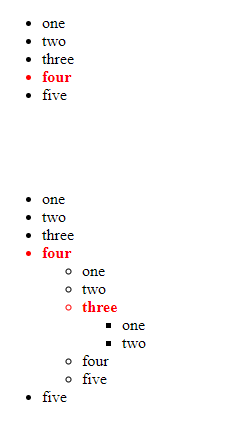

# Code Challenge 01
JS, HTML, CSS3
###  Lists of lists

Taking the Arrays in `data/index.js`, you will need to display them as an unordered list on a html page.

If the array element has the property `isSelected` then make it red and bold.

if the element has a sub list **AND** the property `isSelected` then display a nested unordered list from that item.

Your code should work for either list.

No extra packages to be used.

### Example
